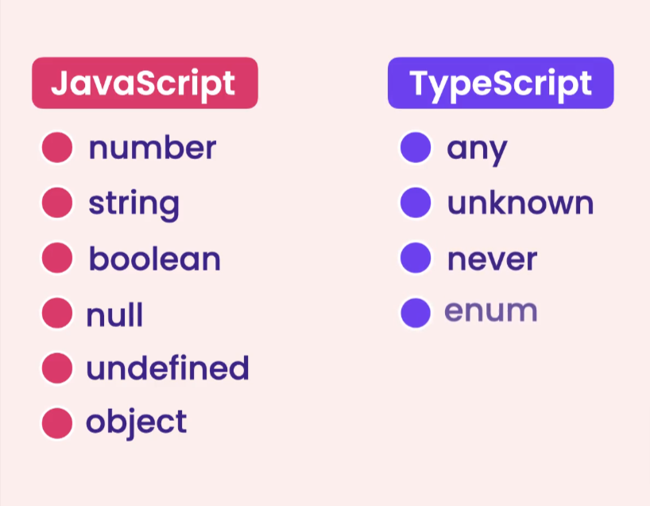

# Getting Started

The below course content is from [CodeWithMosh](https://codewithmosh.com/p/the-ultimate-typescript).

## Terms

* Dynamically-typed Languages
* IntelliSense
* Refactoring
* Source maps
* Statically-typed Languages
* Transpiling
* Type safety

## Summary

* Programming languages divide into two categories: statically-typed and dynamically-
  typed.
* In statically-typed languages (eg C++, C#, Java, etc), the type of variables is set at
  compile-time and cannot change later.
* In dynamically-typed languages (eg Python, JavaScript, Ruby), the type of variables is
  determined at run-time and can change later.
* TypeScript is essentially JavaScript with static typing and some additional features that
  help us write more concise and robust code.
* Most IDEs and code editors supporting TypeScript provide incredible IntelliSense and
  auto-completion. So we get active hints as we code. A great productivity booster!
* By providing type information in our code, we get better refactoring support in most
  IDEs and code editors.
* Refactoring means changing the structure of the code without changing its behavior.
* With TypeScript we can catch more bugs at compile time.
* Browsers don’t understand TypeScript code. So we need to use the TypeScript compiler
  to compile and translate (or transpile) our TypeScript code into regular JavaScript for
  execution by browsers.
* Source maps are files that represent the mapping between TypeScript and JavaScript
  code. They’re used for debugging.
* We can configure the TypeScript compiler by enabling/disabling various settings in
  tsconfig.json.



## Strict Compiler Option

The strict option enables a range of type-checking behavior. The exact settings affected by this are dependent on the version of the TypeScript compiler you're using.

The newer versions may introduce additional stricter checking under this flag so upgrading the TypeScript compiler may result in new errors.

You can see the exact options enabled by turning on the strict setting here:

* [https://www.typescriptlang.org/tsconfig/#strict]()

## Fundamentals

### Summary

* Since TypeScript is a superset of JavaScript, it includes all the built-in types in
  JavaScript (eg number, string, boolean, object, etc) as well as additional types (eg any, unknown, never, enum, tuple, etc).
* In TypeScript, we set the type of our variables by annotating them.
* The **any** type can represent any kind of value. It’s something we should avoid as much as possible because it defeats the purpose of using TypeScript in the first place. A variable of type any can take **any** kind of value!
* Tuples are fixed-length arrays where each element has a specific type. We often use
  them for representing two or three related values.
* Enums represent a list of related constants.

### Cheat Sheet

### Annotation

```
let sales: number = 123_456_789;
let numbers: number[] = [1, 2, 3];
```

### Tuples

```
let user: [number, string] = [1, 'Milind'];
```

### Enums

```
enum Size { Small = 1, Medium, Large }
```

### Functions

```
function calculateTax(income: number): number {
return income * .2;
}
```

### Objects

```
let employee: {
id: number;
name: string;
retire: (date: Date) => void
} = {
id: 1,
name: 'Milind',
retire: (date: Date) => {},
};
```

### Compiler Options

| Option             | Description                                                                                                                                                                                          |
| ------------------ | ---------------------------------------------------------------------------------------------------------------------------------------------------------------------------------------------------- |
| noImplicitAny      | When enabled, the compiler will warn you about variables that are inferred with the**any** type. You'll then have to explicitly annotate them with**any** if you have a reason to do so. |
| noImplicitReturns  | When enabled, the compiler will check all code paths in a function to ensure they return a value.                                                                                                    |
| noUnusedLocals     | When enabled, the compiler will report unused local variables.                                                                                                                                       |
| noUnusedParameters | When enabled, the compiler will report unused parameters.                                                                                                                                            |

## Advanced Types

### Summary

* Using a type alias we can create a new name (alias) for a type. We often use type aliases
  to create custom types.
* With union types, we can allow a variable to take one of many types (eg number |
  string).
* With intersection types, we can combine multiple types into one (eg Draggable &
  Resizable).
* Using optional chaining (?.) we can simplify our code and remove the need for null
  checks.
* Using the Nullish Coalescing Operator we can fallback to a default value when dealing
  with null/undefined objects.
* Sometimes we know more about the type of a variable than the TypeScript compiler. In
  those situations, we can use the as keyword to specify a different type than the one
  inferred by the compiler. This is called type assertion.
* The unknown type is the type-safe version of any. Similar to any, it can represent any
  value but we cannot perform any operations on an unknown type without first
  narrowing to a more specific type.
* The never type represents values that never occur. We often use them to annotate
  functions that never return or always throw an error.

### Cheat Sheet

### Type alias

```
type Employee = {
id: number;
name: string;
retire: (date: Date) => void
```

### Union types

```
let weight: number | string = 1;
weight = '1kg';
```

### Intersection types

```
type UIWidget = Draggable & Droppable;
```

### Literal types

```
type Quantity = 50 | 100;
```

### Nullable types

```
let name: string | null = null;
```

### Optional chaining (?.)

```
customer?.birthdate?.getFullYear();
customers?.[0];
log?.('message');
```

### Nullish coalescing operator

```
someValue ?? 30
```

### Type assertion

```
obj as Person
```

### The unknown type

```
function render(document: unknown) {
// We have to narrow down to a specific
// type before we can perform any operations
// on an unknown type.
if (typeof document === 'string') {
}
}
```

### The never type

```
function processEvents(): never {
// This function never returns because
// it has an infinite loop.
while (true) {}
}
```

### Compiler Options

| Option               | Description                                                                                                                                                                                      |
| -------------------- | ------------------------------------------------------------------------------------------------------------------------------------------------------------------------------------------------ |
| strictNullChecks     | When enabled, null and undefined will not be acceptable values for variables unless you explicitly declare them as nullable. So, you'll get an error if you set a variable to null or undefined. |
| allowUnreachableCode | When set the false, reports error about unreachable code.                                                                                                                                        |
